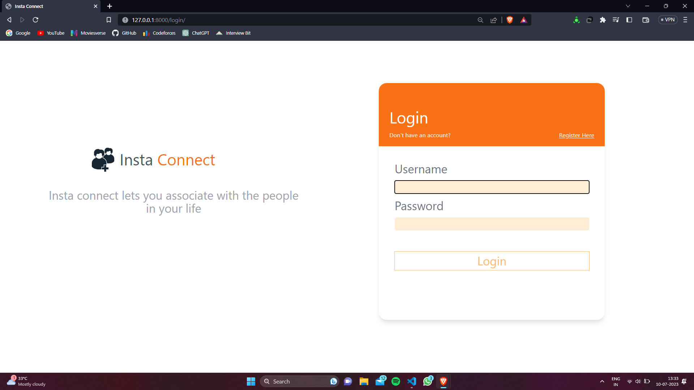
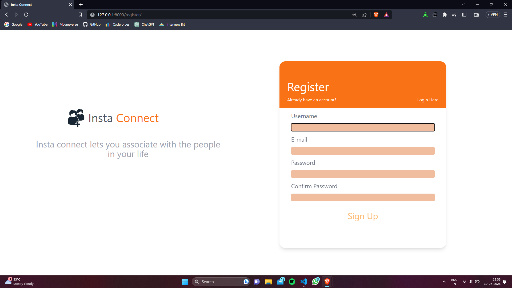
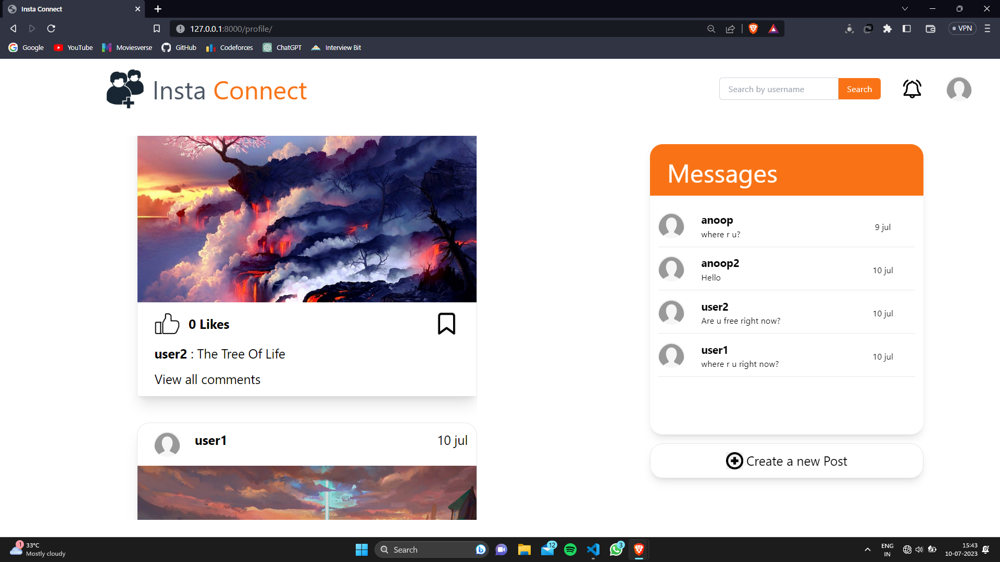
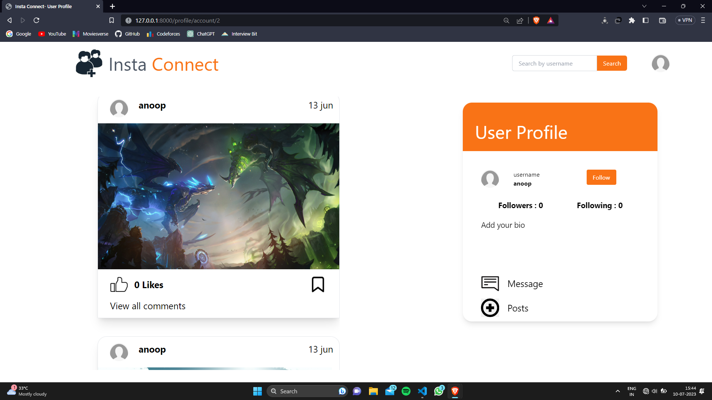
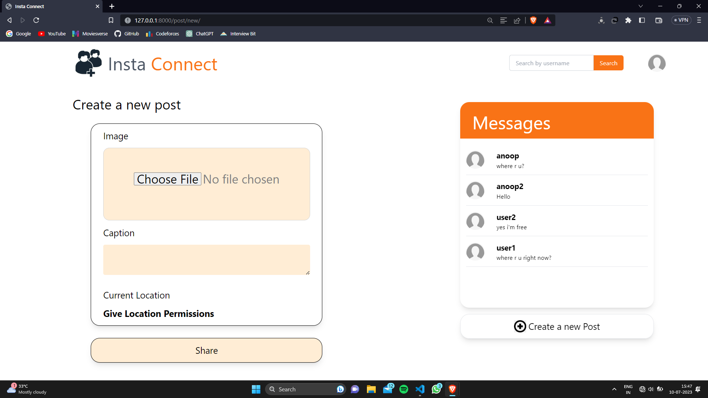
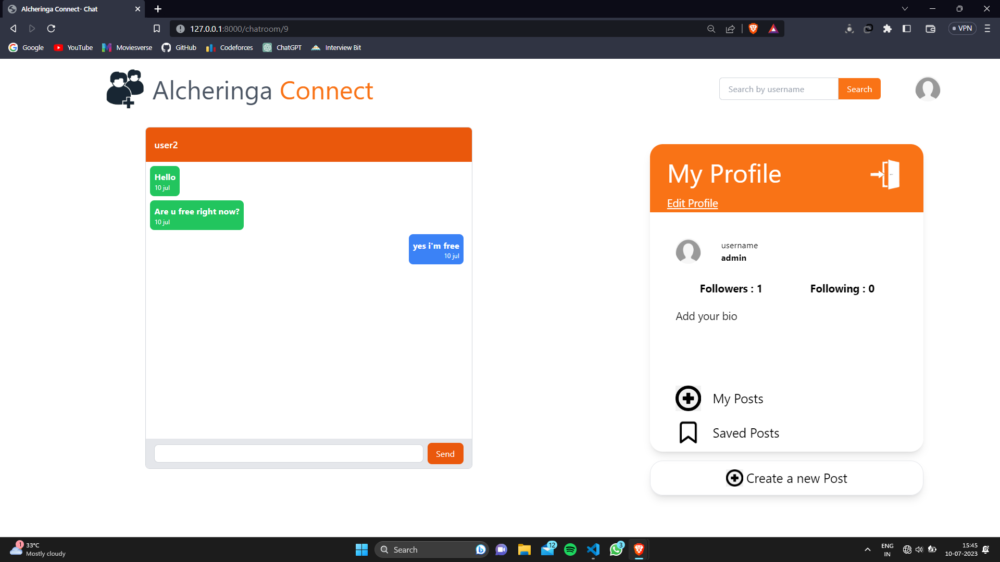
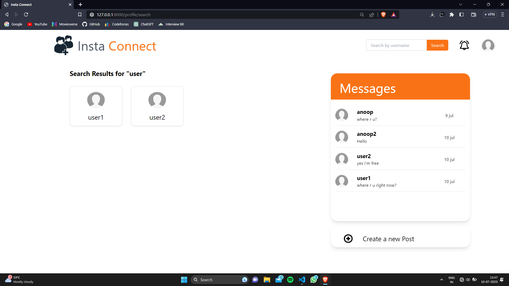
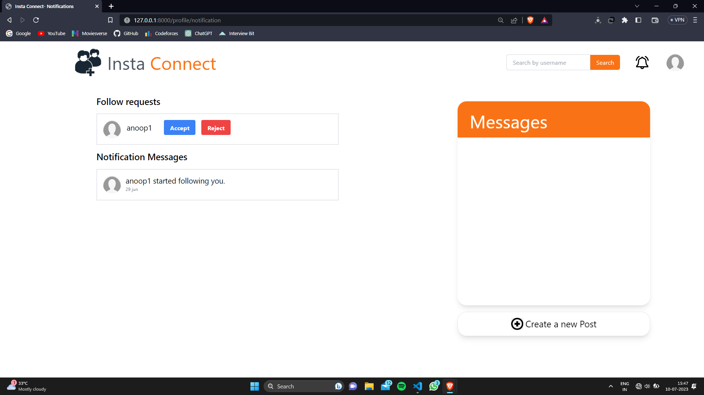

# My Social Networking Website Project

## Table of Contents

- [Overview](#overview)
- [Demo](#demo)
- [Features](#features)
- [Installation](#installation)
- [Usage](#usage)
- [Screenshots](#screenshots)
- [Feedback](#feedback)


## Overview

The Social Networking Website is a platform that allows users to connect with others, share experiences, and engage in meaningful interactions. Built with Django as the backend framework and styled using Tailwind CSS, this website provides a modern and user-friendly interface.

## Demo

A link to a video demo of social networking website.
https://www.youtube.com/watch?v=0g-jPhgflOs

[](https://www.youtube.com/watch?v=0g-jPhgflOs)

## Features

### 1. User Profiles and Authentication

- Create a personalized user profile with profile picture, bio, and contact information.
- Secure authentication system with OTP verification on signup.
- Password recovery and account management options.

### 2. News Feed

- Real-time updates and notifications for new posts, comments, and likes.
- Ability to filter and sort the news feed based on preferences.

### 3. Friends and Connections

- Search and connect with friends and acquaintances.
- Send and receive friend requests, with the option to accept or decline.
<!-- - Maintain a list of friends for easy communication and updates. -->

### 4. Messaging and Chat

- Private encrypted messaging system for one-on-one conversations.
<!-- - Group chats for multiple participants to discuss shared interests.
- Multimedia support for sending photos, videos, and files. -->

### 5. Post Creation and Sharing

- Create posts with text and photos.
<!-- - Tag friends, locations, and topics in posts. -->
- Privacy settings to control who can see and interact with your posts.

<!-- ### 6. News and Events

- Stay updated with the latest news and trending topics.
- Discover and join events, both online and offline.
- RSVP to events and invite friends to join. -->

<!-- ### 7. Groups and Communities

- Create or join groups based on interests, hobbies, or professional networks.
- Share posts, discussions, and resources within groups.
- Admin tools for group moderation and member management. -->

### 6. Privacy and Security

- Privacy settings to control who can view your profile and posts.
<!-- - Reporting and blocking features to address inappropriate content or behavior. -->
- Regular security audits and measures to protect user data.

<!-- ### 9. Recommendations and Discovery

- Personalized recommendations for friends, groups, events, and pages.
- Explore new content and profiles based on your interests.
- Trending and popular sections to discover engaging content. -->

<!-- ### 10. Mobile-Friendly Design

- Responsive design for seamless user experience on mobile devices.
- Native mobile apps for iOS and Android platforms. -->

## Installation

Follow these steps to set up the Social Networking Website on your local machine:

### Prerequisites

- Python 3.7 or higher installed on your system.
- Pip package manager (usually comes with Python installation).

### 1. Clone the repository
```bash
git clone https://github.com/anoop7384/Social_Media_Website.git
```

### 2. Create a virtual environment (optional but recommended)
```bash
python3 -m venv env
source env/bin/activate
```

### 3. Install dependencies
```bash
pip install -r requirements.txt
```

### 4. Start the development server
```bash
python manage.py runserver
```
The website will now be accessible locally at http://localhost:8000/.


## Usage

Once the development server is running, you can access the Website by opening a web browser and navigating to http://localhost:8000/.

You can sign up for a new account  to explore the various features of the website, including creating posts, connecting with friends, messaging friends, and more.

## Screenshots

Here are some screenshots of the Social Networking Website to give you a glimpse of its various pages and features.

## Login Page


## Registration Page


## Home Page


## User Profile Page


## Post Creation Page


## Message Page


## Serch Bar Page


## Notification Page



These screenshots provide an overview of the website's design and user interface. The actual website may have additional features and pages not depicted here.


## Feedback
We appreciate your feedback and are dedicated to providing a positive user experience. If you have any suggestions, encounter issues, or need support, please reach out to our support team at anoop553407@gmail.com.